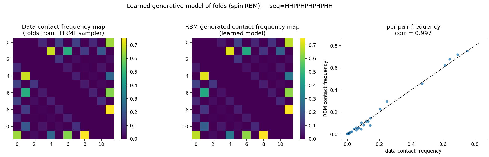
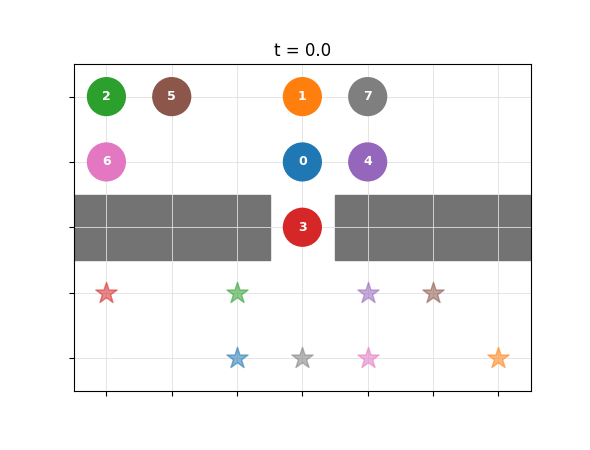
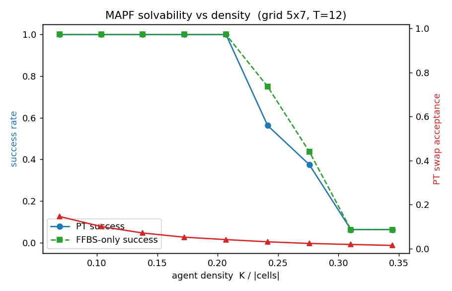

# Extropic / THRML — Protein Folding & Multi-Agent Path Finding

Two probabilistic-computing use cases built on
[THRML](https://github.com/extropic-ai/thrml), Extropic's GPU simulator of the block-Gibbs
sampling programs that run natively on its probabilistic-computing hardware. Both projects
encode a hard combinatorial problem as an **energy-based model**, sample/optimize it with
**block Gibbs** (+ parallel tempering), and **learn** an energy-based model on the resulting
data — and every result is **validated against exact ground truth**.

> **Thesis.** A probabilistic computer is a general engine for problems whose answer is a
> low-energy or equilibrium configuration. We demonstrate the full loop — *sample, optimize,
> and learn* — on two very different domains (a physics problem and a robotics problem),
> showing the same THRML primitives carry across both.

Both projects share a structure:

| | Pillar 1 — sample / optimize | Pillar 2 — learn |
|---|---|---|
| **Protein folding** | fold thermodynamics + ground-state search; annealing → **parallel tempering (150–660× TTS speedup)** | spin RBM trained on sampled folds reproduces the fold ensemble (**contact-map corr 0.997**) |
| **Multi-agent path finding** | collision-free plans by sampling a space-time EBM with start/goal clamped; feasibility studies + parallel tempering + CBS baseline | conditional RBM policy trained by contrastive KL **solves 100% of unseen instances** (no search) |

---

## Project 1 — Lattice protein folding  ([`protein/`](protein/))

The HP lattice-protein model encoded as a Potts EBM: each residue is a categorical variable
over lattice sites; energy rewards H–H contacts subject to a self-avoiding-walk backbone.



**Highlights** (full details in [`protein/README.md`](protein/README.md) and [`protein/RESULTS.md`](protein/RESULTS.md)):
- **Correct sampling** — sampled vs exact Boltzmann distribution: total-variation **0.007**.
- **Folding thermodynamics** — specific heat C(T), native-contact fraction Q(T), R_g collapse,
  all matching **exact self-avoiding-walk enumeration** (contacts to 0.013); folding transition
  at β≈2.22. `thermo.png`
- **Optimization** — verified against the canonical 2D HP benchmark optima; time-to-solution
  has a minimum at short budgets; plain annealing only solves N≤24. `phaseB_*.png`
- **Parallel tempering** — **150–666× TTS speedups** and solves instances annealing never
  reaches. `pt_vs_anneal.png`
- **Learned generative model** — a spin RBM trained (THRML contrastive KL) on 148k sampled
  folds reproduces the contact-frequency map at **corr 0.997**. `ebm_rbm.png`
- **Hardware** — throughput, wall-clock TTS, energy-to-solution + an Extropic projection.
  `phaseC_hardware.png`

## Project 2 — Multi-agent path finding  ([`mapf/`](mapf/))

Robots on a space-time grid encoded as a heterogeneous EBM: agent positions are one-hot
spins over cells/time; collisions and illegal moves are energy penalties; start/goal are
**clamped** and collision-free trajectories are **sampled** — solving a planning problem by
sampling instead of search.





**Highlights** (full details in [`mapf/REPORT.md`](mapf/REPORT.md)):
- **Encoding + exact validation** — space-time Potts EBM, validated against exact enumeration
  and a classical **Conflict-Based Search (CBS)** baseline.
- **Sampling-based planning** — feasibility studies and parallel tempering produce
  collision-free coordinated plans; animated rollouts (`mapf*.gif`, `*_filmstrip.png`).
- **Learned conditional policy** — a conditional RBM trained by contrastive KL on
  self-distilled FFBS solutions **solves 100% of 15 held-out (unseen start/goal) instances**
  by drawing parallel samples (no search); a hybrid variant bakes constraints into the energy
  to raise per-sample validity. `learned_*.gif`, `learned_*_filmstrip.png`

---

## Shared methodology

- **Energy-based encoding** of hard constraints as penalties (QUBO / Potts), with clamping
  for conditioning (fixed residue / fixed start-goal).
- **Block Gibbs sampling** on GPU via THRML, `vmap`-ed over thousands of parallel chains;
  **simulated annealing** and **parallel tempering** as schedules on top.
- **Energy-based learning** via THRML's contrastive-KL gradient (`estimate_kl_grad`).
- **Validate against ground truth first** — exact enumeration, exact samplers (SAW
  density-of-states / FFBS), and classical baselines (CBS) — because sampling fails silently.

## Repository layout

```
protein/   HP lattice-protein folding (encoding, thermodynamics, optimization, PT, RBM, hardware)
mapf/      multi-agent path finding (encoding, CBS/FFBS validation, PT, learned policy, viz)
ising_warmup.py   2D Ising toolchain check — reproduces the exact Onsager Tc (a sanity warmup)
```

Each subproject has its own README/REPORT with full numbers, figures, and run commands.

## Setup

Requires an NVIDIA GPU (developed on an RTX 4090).

```bash
conda create -n thrml python=3.12 -y && conda activate thrml
pip install "jax[cuda12]" optax networkx matplotlib scikit-learn imageio
pip install thrml
export XLA_PYTHON_CLIENT_PREALLOCATE=false
```

Then see the per-project READMEs for the exact commands (e.g. `python protein/thermo.py`,
`python mapf/validate_cbs.py`).

## References & acknowledgements
- THRML: https://github.com/extropic-ai/thrml · docs https://docs.thrml.ai
- Extropic probabilistic computing: https://arxiv.org/abs/2510.23972
- HP benchmark optima cross-checked vs Mann et al. (PMC5172541)

Built with THRML; this repository contains only the use-case code and results, not THRML itself.
